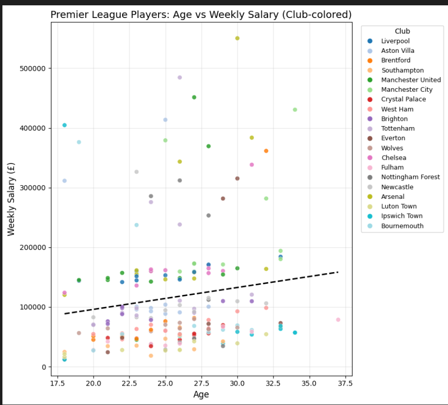

🏟 Premier League Player Age vs Salary Visualization

This project explores the relationship between player age and weekly salary in the Premier League.
It uses a custom-generated dataset of 200 players and produces a clean visualization using Matplotlib and Pandas.

📊 Project Features

200-player dataset

Real Premier League club names

Clean Matplotlib scatter plot

Club-colored visualization

Helps understand salary trends vs age

📁 Files
File	Description
premier_league_realnames_ages_salaries.csv	Clean dataset of 200 Premier League players
age_vs_salary_club_colored.png	Final visualization
visualization.py	Python script generating the plot (if added)
📈 Visualization Preview

(Insert your image here later)

🛠 Tools Used

Python

Pandas

NumPy

Matplotlib

💡 Insights

Players aged 24–30 earn the highest salaries

Top clubs (Arsenal, City, Chelsea, Liverpool) dominate the top salary bracket

Younger players cluster around lower salary ranges
